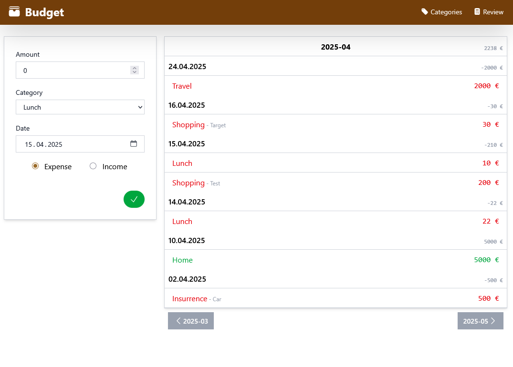
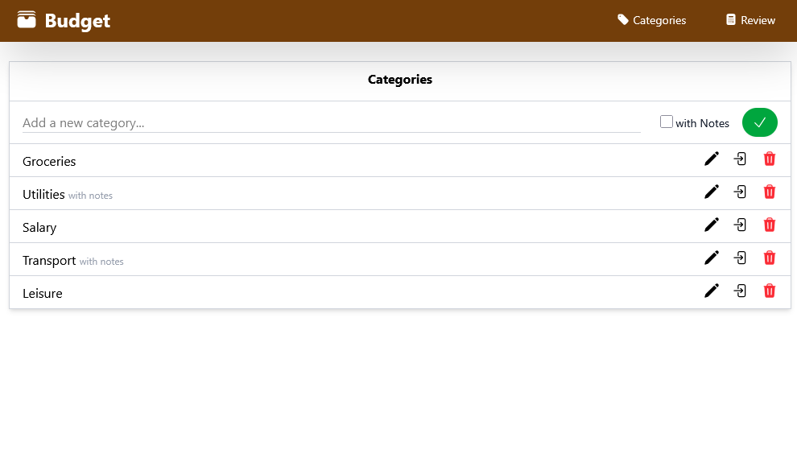
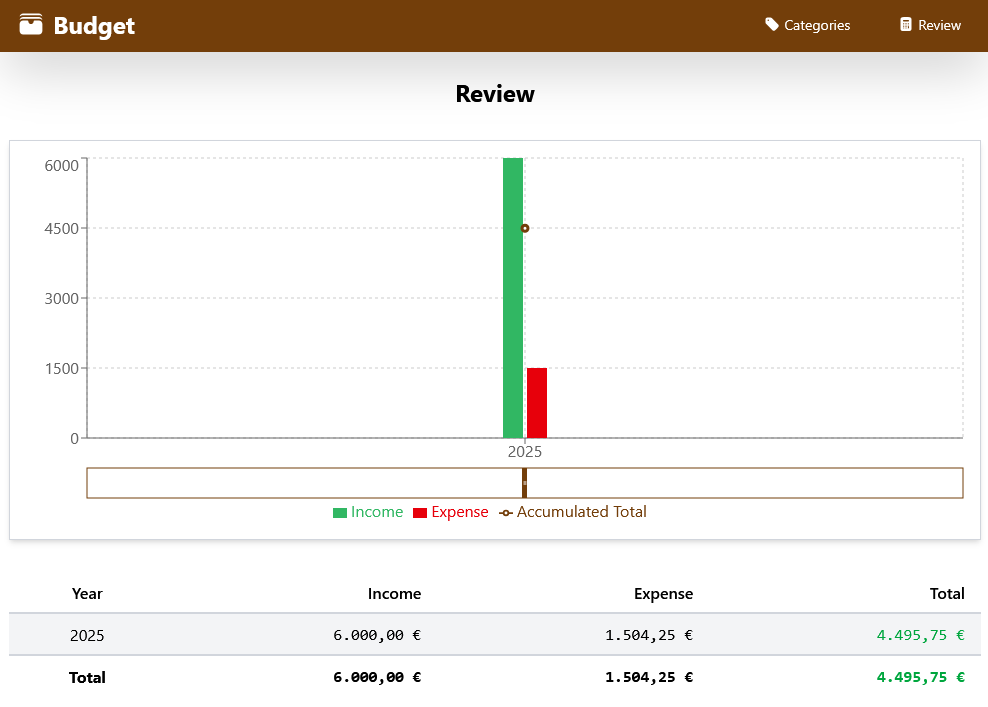
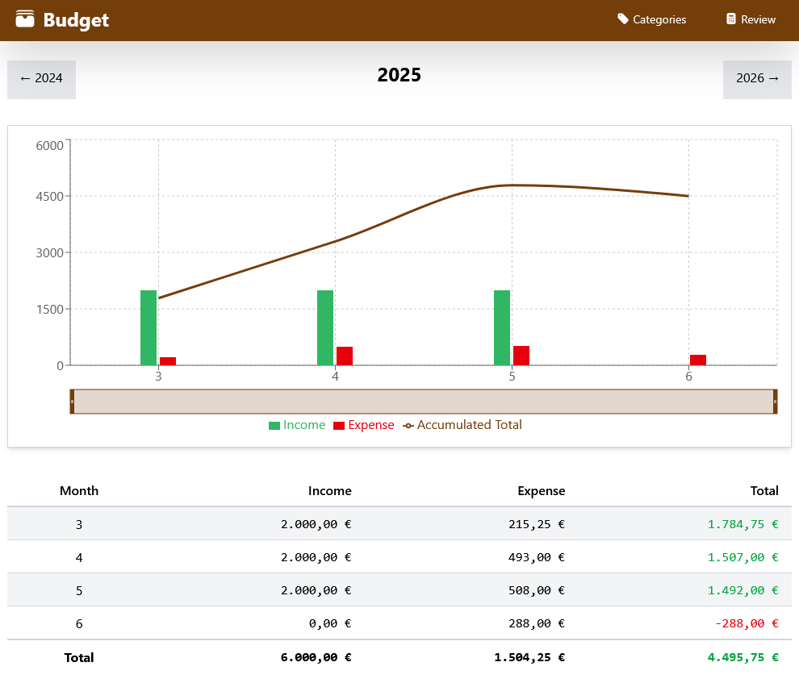

# Budget

A personal finance tracker built with React. It helps you track expenses and income without requiring accounting knowledge. Each transaction is categorized, and the app provides review and reporting capabilities.

## Features ✨

### Core Functionality

- 📊 Track expenses and income with categorized transactions
- ✏️ Create, edit, and delete transactions and categories
- 🕒 View transaction history in a clean, modern interface
- 🐳 Simple deployment with container support
- 🌍 Localization
- 📈 Show yearly and monthly income expense charts to analyze your budget
- 📈 Generate expense charts by category
- 🔒 User authentication

### Future Plans 🚀

- ToDo/Shopping List
- 📶 Offline-first functionality with PWA support (Coming Soon)
- 🔄 Export/Import data capabilities (Coming Soon)

## Screenshots 📸

Here are some screenshots of the app in action:

| Home                            | Categories                                     |
| ------------------------------- | ---------------------------------------------- |
|  |  |

| Review yearly                              | monthly                                      |
| ------------------------------------------ | -------------------------------------------- |
|  |  |

## Technology Stack 🛠️

- ⚛️ React
- 🧰 TanStack [Start](https://tanstack.com/start/latest), [Query](https://tanstack.com/query/latest) and [Form](https://tanstack.com/form/latest)
- 🎨 Tailwind CSS
- 🗄️ SQLite
- 📦 pnpm

## Installation & Setup ⚙️

### Prerequisites

- 🖥️ Node.js (>=23.0) and pnpm installed

### Steps

1. Clone the repository:

```bash
git clone https://github.com/nogo/budget.git
cd budget
```

2. Copy the environment configuration file:

```bash
cp .env.example .env
```

3. Install dependencies:

```bash
pnpm install
```

4. Start the development server:

```bash
pnpm run dev
```

## Docker Usage 🐳

### Build the images

```bash
docker compose build
```

### Run database migrations (one-time, before first launch)

```bash
docker compose run --rm budget-migrate
```

### Start the application

```bash
docker compose up budget-app
```

The app will be available at [http://localhost:3000](http://localhost:3000).

## Glossary 📚

| **Term**        | **Definition**                                                            |
| --------------- | ------------------------------------------------------------------------- |
| **Expense**     | An amount spent on goods or services.                                     |
| **Income**      | Money received from sources such as work, investments, or selling assets. |
| **Transaction** | An action to add or remove an item from a collection.                     |
| **Category**    | A label used to organize transactions.                                    |
