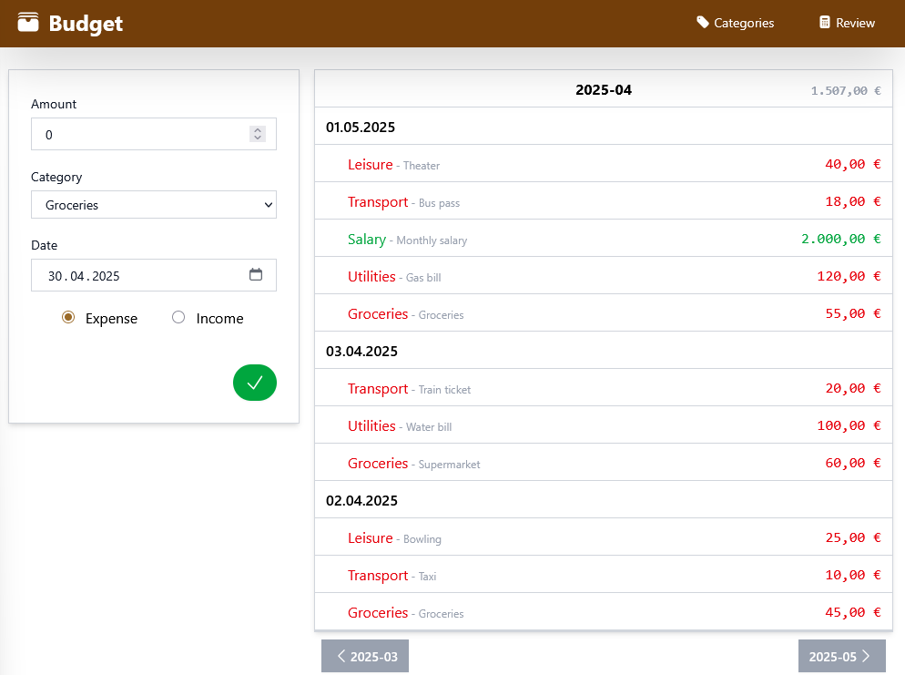

# Budget

A personal finance tracker built with React. It helps you track expenses and income without requiring accounting knowledge. Each transaction is categorized, and the app provides review and reporting capabilities.

## Features ✨

### Core Functionality

- 📊 Track expenses and income with categorized transactions
- ✏️ Create, edit, search, filter and delete transactions
- ✏️ Create, edit and delete categories and templates
- 🕒 View transaction history in a clean, modern interface
- 🐳 Simple deployment with container support
- 🌍 Localization in English and German
- 📈 Show yearly and monthly income expense charts to analyze your budget
- 📈 Generate expense charts by category
- 🔒 User authentication
- 📶 Progressive Web App (PWA) with offline support and auto-updates
- 🔄 App version display and update notifications

### Future Plans 🚀

- 🔄 Export/Import data capabilities (Coming Soon)
- ToDo/Shopping List

## Screenshots 📸

Here are some screenshots of the app in action:

| Home                            | Categories                                     |
| ------------------------------- | ---------------------------------------------- |
|  |  |

| Review yearly                              | monthly                                      |
| ------------------------------------------ | -------------------------------------------- |
|  |  |

## Technology Stack 🛠️

- ⚛️ React 19
- 🧰 TanStack [Start](https://tanstack.com/start/latest), [Query](https://tanstack.com/query/latest), [Router](https://tanstack.com/router/latest) and [Form](https://tanstack.com/form/latest)
- 🎨 Tailwind CSS 4
- 🗄️ SQLite with Prisma ORM
- 🔐 Better Auth for authentication  
- 📦 Bun runtime and package manager
- 🎯 TypeScript
- ⚡ Vite for build tooling

## Installation & Setup ⚙️

### Prerequisites

- 🖥️ Bun (>=1.0) installed

### Steps

1. Clone the repository:

```bash
git clone https://github.com/nogo/budget.git
cd budget
```

2. Copy the environment configuration file:

```bash
cp .env.example .env
```

3. Install dependencies:

```bash
bun install
```

4. Start the development server:

```bash
bun run dev
```

## Docker Usage 🐳

### Build the images

```bash
docker compose build
```

### Run database migrations (one-time, before first launch)

```bash
docker compose run --rm budget-migrate
```

### Start the application

```bash
docker compose up budget-app
```

The app will be available at [http://localhost:3000](http://localhost:3000).

## Progressive Web App Features 📱

### Installation
- Install the app on your device through your browser
- Works offline once installed
- Automatic background updates when connected

### App Version & Updates
- Version number displayed in the navigation bar
- Automatic update notifications when new versions are available  
- One-click update installation with user confirmation
- Seamless updates without losing your data

### Offline Support
- Caches essential app resources for offline use
- API requests cached for 5 minutes for better performance
- Fonts and static assets cached for optimal loading

## Glossary 📚

| **Term**        | **Definition**                                                            |
| --------------- | ------------------------------------------------------------------------- |
| **Expense**     | An amount spent on goods or services.                                     |
| **Income**      | Money received from sources such as work, investments, or selling assets. |
| **Transaction** | An action to add or remove an item from a collection.                     |
| **Category**    | A label used to organize transactions.                                    |
